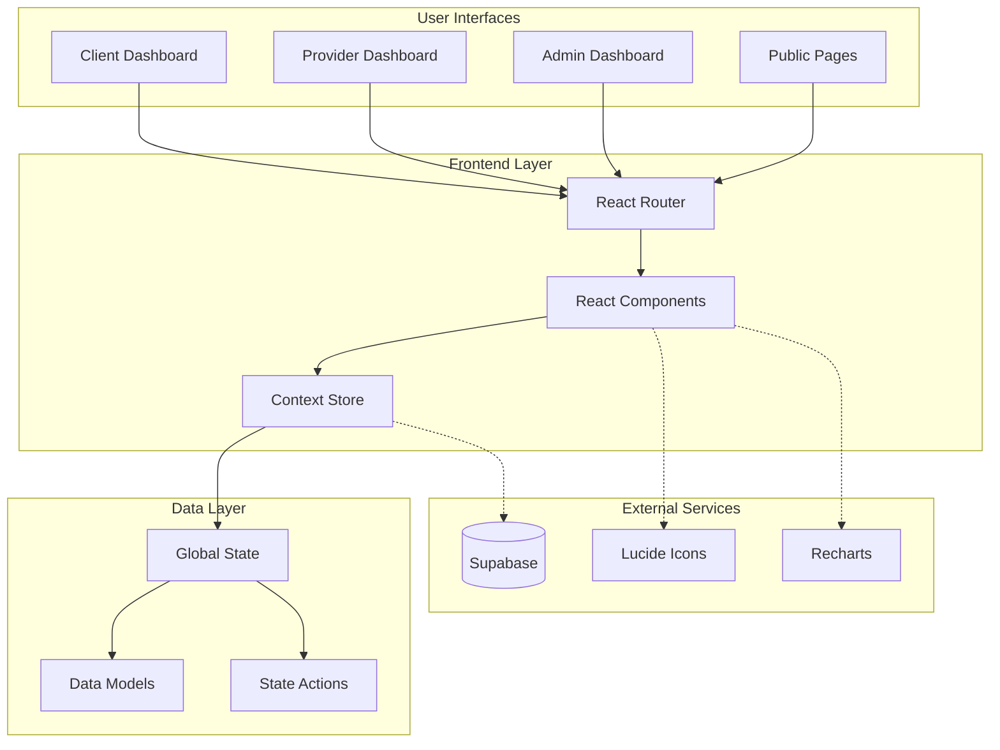
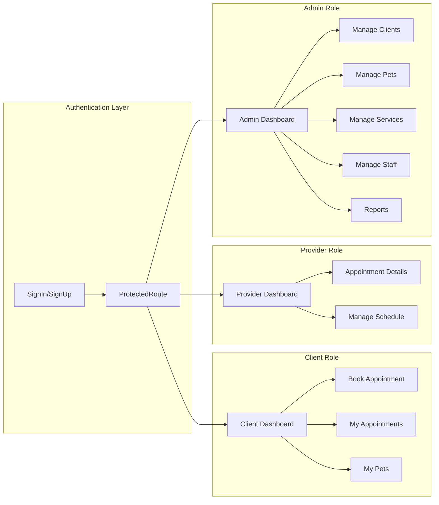
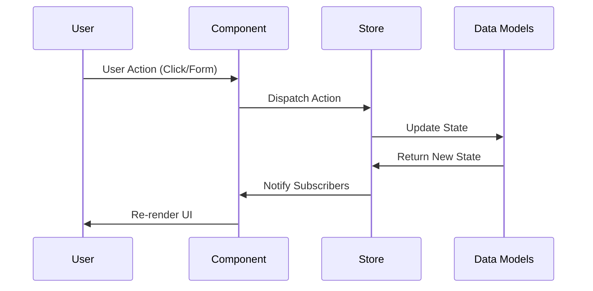
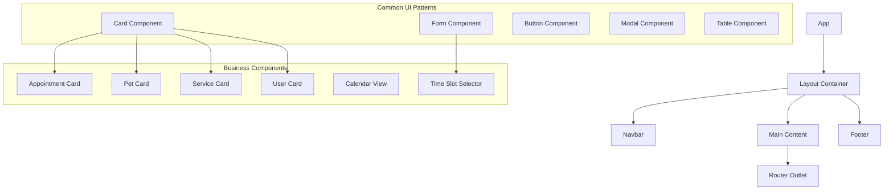
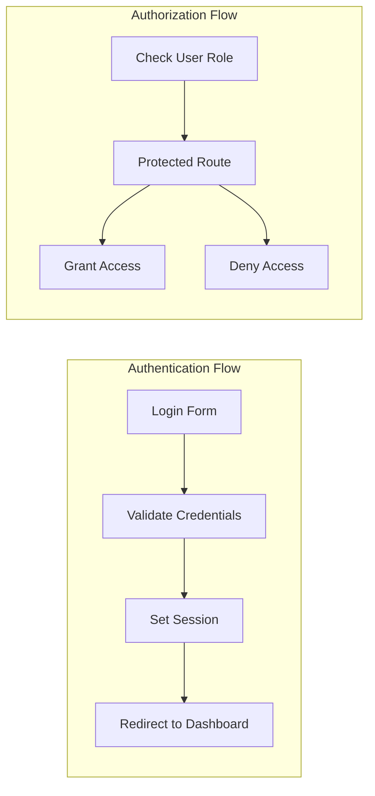
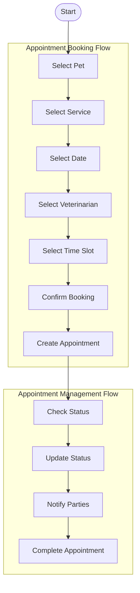
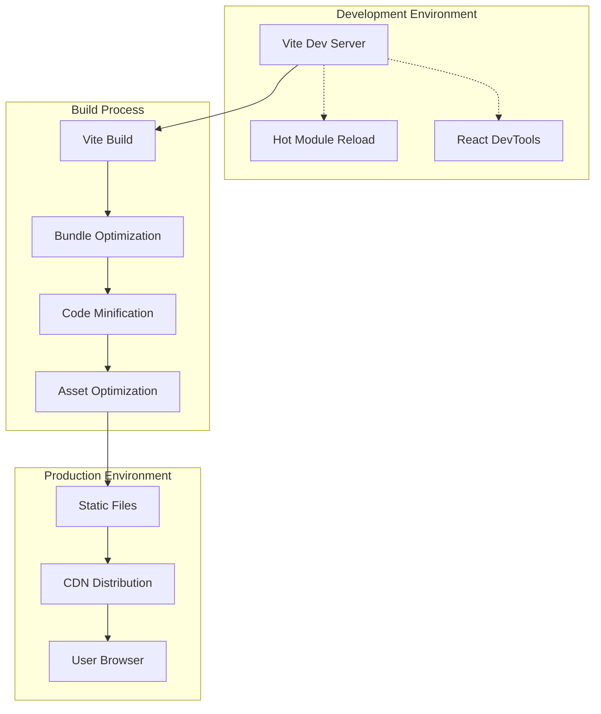
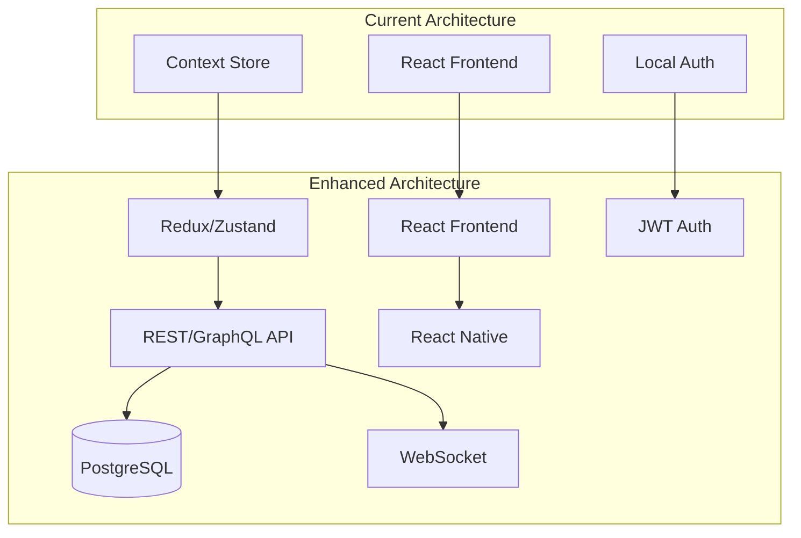

# PawBook System Architecture Diagrams

## 🏗️ Overall System Architecture

## 🎭 User Role Architecture

## 📊 Data Flow Architecture

## 🗂️ Component Architecture

```mermaid
graph TD
    App[App.tsx]
    
    subgraph "Layout Components"
        Navbar[Navbar.tsx]
        Footer[Footer.tsx]
    end
    
    subgraph "Auth Components"
        SignIn[SignIn.tsx]
        SignUp[SignUp.tsx]
        Protected[ProtectedRoute.tsx]
    end
    
    subgraph "Page Components"
        Landing[LandingPage.tsx]
        
        subgraph "Client Pages"
            ClientDash[ClientDashboard.tsx]
            BookAppt[BookAppointment.tsx]
            ClientAppts[MyAppointments.tsx]
            ClientPets[MyPets.tsx]
        end
        
        subgraph "Provider Pages"
            ProviderDash[ProviderDashboard.tsx]
            ApptDetail[AppointmentDetail.tsx]
            MgmtSchedule[ManageSchedule.tsx]
        end
        
        subgraph "Admin Pages"
            AdminDash[AdminDashboard.tsx]
            CreateProv[CreateProvider.tsx]
            MgmtAppts[ManageAppointments.tsx]
            MgmtClients[ManageClients.tsx]
            MgmtPets[ManagePets.tsx]
            MgmtServices[ManageServices.tsx]
            MgmtStaff[ManageStaff.tsx]
            AdminReports[Reports.tsx]
        end
    end
    
    App --> Navbar
    App --> Footer
    App --> SignIn
    App --> SignUp
    App --> Landing
    App --> Protected
    
    Protected --> ClientDash
    Protected --> ProviderDash
    Protected --> AdminDash
    
    ClientDash --> BookAppt
    ClientDash --> ClientAppts
    ClientDash --> ClientPets
    
    ProviderDash --> ApptDetail
    ProviderDash --> MgmtSchedule
    
    AdminDash --> CreateProv
    AdminDash --> MgmtAppts
    AdminDash --> MgmtClients
    AdminDash --> MgmtPets
    AdminDash --> MgmtServices
    AdminDash --> MgmtStaff
    AdminDash --> AdminReports
```

## 🔄 State Management Architecture

```mermaid
graph TB
    subgraph "React Context"
        AppProvider[AppProvider]
        AppContext[AppContext]
        useApp[useApp Hook]
    end
    
    subgraph "State Data"
        CurrentUser[currentUser]
        Users[users]
        Pets[pets]
        Services[services]
        Vets[veterinarians]
        Appointments[appointments]
    end
    
    subgraph "State Actions"
        SignIn[signIn]
        SignUp[signUp]
        SignOut[signOut]
        AddPet[addPet]
        UpdatePet[updatePet]
        DeletePet[deletePet]
        AddAppt[addAppointment]
        UpdateAppt[updateAppointment]
        CancelAppt[cancelAppointment]
        AddUser[addUser]
        UpdateUser[updateUser]
        DeleteUser[deleteUser]
        UpdateService[updateService]
        AddService[addService]
        DeleteService[deleteService]
        AddVet[addVeterinarian]
        DeleteVet[deleteVeterinarian]
    end
    
    AppProvider --> AppContext
    AppContext --> useApp
    
    useApp --> CurrentUser
    useApp --> Users
    useApp --> Pets
    useApp --> Services
    useApp --> Vets
    useApp --> Appointments
    
    useApp --> SignIn
    useApp --> SignUp
    useApp --> SignOut
    useApp --> AddPet
    useApp --> UpdatePet
    useApp --> DeletePet
    useApp --> AddAppt
    useApp --> UpdateAppt
    useApp --> CancelAppt
    useApp --> AddUser
    useApp --> UpdateUser
    useApp --> DeleteUser
    useApp --> UpdateService
    useApp --> AddService
    useApp --> DeleteService
    useApp --> AddVet
    useApp --> DeleteVet
```

## 🎨 UI Component Hierarchy

## 🔐 Security Architecture

## 📈 Business Logic Flow

## 🚀 Deployment Architecture

## 🔮 Future Architecture Enhancements

