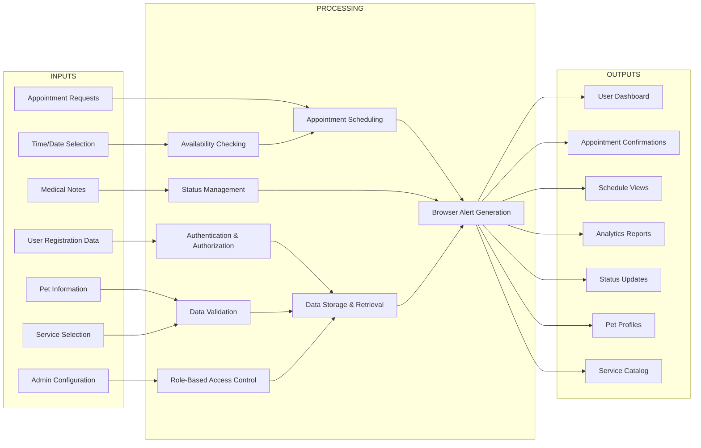

# PawBook Veterinary Management System - IPO Diagram and Analysis

## IPO Diagram (Input-Process-Output)

---

## IPO Analysis Discussion

### **Input Layer Analysis**

#### **Primary Input Sources and Business Significance**

**I1: User Registration Data**
- **Content**: Email, password, name, phone number, role assignment
- **Business Impact**: Forms foundation of system security and user management
- **System Role**: Enables multi-role architecture (client, provider, admin)
- **Data Flow**: Authentication Process → User Store → Session Management
- **Criticality**: HIGH - Without proper registration, system access is impossible

**I2: Pet Information**
- **Content**: Pet name, species, breed, age, weight, medical notes
- **Business Impact**: Enables personalized veterinary care and appointment booking
- **System Role**: Core data for clinical decision-making and service personalization
- **Data Flow**: Data Validation → Pet Store → Appointment Integration
- **Criticality**: HIGH - Essential for veterinary service delivery

**I3: Appointment Requests**
- **Content**: Service preferences, timing requirements, special considerations
- **Business Impact**: Primary revenue-generating input and core business transaction
- **System Role**: Drives appointment scheduling and resource allocation
- **Data Flow**: Appointment Scheduling → Availability Checking → Booking Confirmation
- **Criticality**: CRITICAL - Core business process driver

**I4: Service Selection**
- **Content**: Service type, duration, pricing, provider preference
- **Business Impact**: Determines appointment parameters and pricing structure
- **System Role**: Controls service catalog utilization and revenue calculation
- **Data Flow**: Service Catalog → Data Validation → Appointment Integration
- **Criticality**: HIGH - Direct impact on revenue and resource planning

**I5: Time/Date Selection**
- **Content**: Preferred appointment date, time slot, flexibility requirements
- **Business Impact**: Affects resource utilization and customer satisfaction
- **System Role**: Critical for scheduling optimization and conflict prevention
- **Data Flow**: Availability Checking → Schedule Management → Confirmation
- **Criticality**: HIGH - Determines operational efficiency

**I6: Medical Notes**
- **Content**: Clinical observations, treatment notes, patient history updates
- **Business Impact**: Maintains continuity of care and clinical quality
- **System Role**: Supports veterinary decision-making and treatment planning
- **Data Flow**: Status Management → Pet Store Integration → Clinical Records
- **Criticality**: MEDIUM - Important for care quality, not revenue-critical

**I7: Admin Configuration**
- **Content**: System settings, service definitions, user permissions, business rules
- **Business Impact**: Controls system behavior and operational parameters
- **System Role**: Enables system customization and business rule enforcement
- **Data Flow**: Role-Based Access → System Configuration → Global Settings
- **Criticality**: HIGH - Affects entire system operation

### **Processing Layer Analysis**

#### **Core Processing Functions and System Integration**

**P1: Authentication & Authorization**
- **Function**: Validates user credentials, manages sessions, enforces access control
- **System Integration**: Interfaces with User Store (D1) and Session Store (D6)
- **Business Logic**: Implements role-based permissions for client, provider, admin access
- **Security Impact**: Prevents unauthorized access and protects sensitive data
- **Performance Considerations**: Must handle concurrent logins and session persistence
- **Error Handling**: Invalid credentials, session timeouts, permission denied scenarios

**P2: Data Validation**
- **Function**: Ensures data integrity, completeness, and format compliance
- **System Integration**: Cross-validates against all data stores (D1-D6)
- **Business Logic**: Enforces data quality standards and business rules
- **Security Impact**: Prevents injection attacks and data corruption
- **Performance Considerations**: Real-time validation without user experience degradation
- **Error Handling**: Invalid formats, missing fields, constraint violations

**P3: Appointment Scheduling**
- **Function**: Coordinates booking, prevents conflicts, manages appointments
- **System Integration**: Links User Store (D1), Pet Store (D2), Service Store (D4), Veterinarian Store (D5)
- **Business Logic**: Implements scheduling rules, availability checking, confirmation workflow
- **Revenue Impact**: Directly affects booking conversion and resource utilization
- **Performance Considerations**: Real-time conflict detection and instant confirmation
- **Error Handling**: Double-booking prevention, availability conflicts, invalid time slots

**P4: Availability Checking**
- **Function**: Validates provider schedules, time slot availability, resource capacity
- **System Integration**: Queries Appointment Store (D3) and Veterinarian Store (D5)
- **Business Logic**: Implements business hours, service duration calculations, buffer times
- **Operational Impact**: Optimizes resource utilization and prevents overbooking
- **Performance Considerations**: Must handle concurrent availability checks
- **Error Handling**: No available slots, provider conflicts, invalid time ranges

**P5: Status Management**
- **Function**: Tracks appointment lifecycle, manages state transitions
- **System Integration**: Updates Appointment Store (D3) and triggers notifications
- **Business Logic**: Implements status flow rules (upcoming → checked-in → completed)
- **Clinical Impact**: Enables real-time workflow management for providers
- **Performance Considerations**: Instant status updates across all user interfaces
- **Error Handling**: Invalid status transitions, concurrent updates

**P6: Role-Based Access Control**
- **Function**: Enforces permission-based access to system features
- **System Integration**: References User Store (D1) roles and permissions
- **Business Logic**: Implements access matrix for client, provider, admin functions
- **Security Impact**: Prevents privilege escalation and unauthorized actions
- **Performance Considerations**: Must not impact user experience with excessive checks
- **Error Handling**: Insufficient permissions, role conflicts, access denied

**P7: Data Storage & Retrieval**
- **Function**: Manages persistent data, ensures data integrity, optimizes access
- **System Integration**: Central hub for all data store operations (D1-D6)
- **Business Logic**: Implements CRUD operations, data consistency, backup strategies
- **Reliability Impact**: Ensures data durability and system availability
- **Performance Considerations**: Efficient query optimization and caching strategies
- **Error Handling**: Connection failures, data corruption, constraint violations

**P8: Browser Alert Generation**
- **Function**: Creates user notifications, provides immediate feedback
- **System Integration**: Interfaces with browser alert system and user interfaces
- **Business Logic**: Implements notification triggers, message formatting, display rules
- **User Experience Impact**: Provides immediate confirmation and error feedback
- **Performance Considerations**: Non-blocking alerts, appropriate timing
- **Error Handling**: Alert failures, display issues, browser compatibility

### **Output Layer Analysis**

#### **Primary System Outputs and Business Value**

**O1: User Dashboard**
- **Content**: Role-specific interface with relevant features and information
- **Business Value**: Primary user interaction point and system gateway
- **User Impact**: Determines system usability and user satisfaction
- **Technical Implementation**: React components with role-based rendering
- **Metrics**: User engagement, feature adoption, session duration
- **Optimization Opportunities**: Personalization, quick actions, responsive design

**O2: Appointment Confirmations**
- **Content**: Booking success messages, appointment details, next steps
- **Business Value**: Reduces uncertainty, prevents no-shows, improves satisfaction
- **User Impact**: Provides assurance and clear communication
- **Technical Implementation**: Browser alerts with appointment information
- **Metrics**: Confirmation rate, user satisfaction, no-show reduction
- **Optimization Opportunities**: Multi-channel notifications, calendar integration

**O3: Schedule Views**
- **Content**: Visual appointment calendars, availability displays, time slot grids
- **Business Value**: Enables efficient time management and resource planning
- **User Impact**: Improves scheduling efficiency and reduces conflicts
- **Technical Implementation**: Calendar components with real-time updates
- **Metrics**: Schedule utilization, booking efficiency, user engagement
- **Optimization Opportunities**: Mobile optimization, filtering options, export functionality

**O4: Analytics Reports**
- **Content**: Business intelligence data, performance metrics, compliance reports
- **Business Value**: Supports strategic decisions and operational optimization
- **User Impact**: Enables data-driven decision-making for administrators
- **Technical Implementation**: Data visualization with charts and trends
- **Metrics**: Report usage, insight adoption, business impact
- **Optimization Opportunities**: Real-time analytics, predictive insights, custom reports

**O5: Status Updates**
- **Content**: Real-time appointment status, workflow progress, system notifications
- **Business Value**: Maintains stakeholder alignment and operational visibility
- **User Impact**: Provides current information and reduces uncertainty
- **Technical Implementation**: Real-time status synchronization across interfaces
- **Metrics**: Update frequency, accuracy, user responsiveness
- **Optimization Opportunities**: Push notifications, status history, escalation rules

**O6: Pet Profiles**
- **Content**: Comprehensive pet information, medical history, appointment links
- **Business Value**: Enables personalized care and clinical decision support
- **User Impact**: Supports pet health management and service continuity
- **Technical Implementation**: Structured data display with editing capabilities
- **Metrics**: Profile completeness, update frequency, integration usage
- **Optimization Opportunities**: Medical record integration, photo uploads, health tracking

**O7: Service Catalog**
- **Content**: Available services, pricing, descriptions, duration information
- **Business Value**: Drives service selection and revenue generation
- **User Impact**: Enables informed decision-making and price transparency
- **Technical Implementation**: Searchable catalog with filtering and comparison
- **Metrics**: Catalog usage, conversion rates, price sensitivity
- **Optimization Opportunities**: Personalized recommendations, package deals, seasonal offerings

---

## IPO Integration with System Architecture

### **Alignment with DFD Level 0**
The IPO diagram directly corresponds to Level 0 DFD external entities:
- **Client Inputs** (I1-I6) map to Pet Owner interactions (1.0-4.0)
- **Provider Inputs** (I6) map to Veterinarian interactions (5.0-8.0)
- **Admin Inputs** (I7) map to Administrator interactions (9.0-12.0)
- **Browser Outputs** (O1-O7) map to Web Browser interface (13.0)

### **Alignment with DFD Level 1**
The IPO processing layer maps to Level 1 DFD processes:
- **P1 Authentication** ↔ **1.0 Authentication Process**
- **P3 Appointment Scheduling** ↔ **2.0 Appointment Management Process**
- **P2 Data Validation** ↔ **Validation within all Level 1 processes**
- **P7 Data Storage** ↔ **All Level 1 data stores (D1-D6)**

### **Data Flow Consistency**
The IPO model maintains consistency with DFD data flows:
- **Input Validation**: All inputs pass through validation before processing
- **Process Integration**: Processing functions coordinate with DFD process definitions
- **Output Generation**: Outputs align with DFD external entity interactions

### **Business Process Alignment**
The IPO diagram reflects PawBook's actual business processes:
- **Customer Journey**: Registration → Pet Management → Appointment Booking → Status Updates
- **Provider Workflow**: Schedule Management → Patient Care → Status Updates → Medical Documentation
- **Administrative Functions**: System Configuration → User Management → Reporting

---

## System Performance and Scalability Considerations

### **Input Processing Scalability**
- **Concurrent Users**: System must handle multiple simultaneous input submissions
- **Data Volume**: Pet profiles and appointment records will grow over time
- **Peak Load Management**: Appointment booking during business hours creates high demand
- **Validation Performance**: Real-time validation must not impact user experience

### **Processing Layer Optimization**
- **Database Efficiency**: Optimized queries for availability checking and data retrieval
- **Caching Strategy**: Frequently accessed data (services, schedules) should be cached
- **Load Balancing**: Distributed processing for high-volume operations
- **Error Recovery**: Robust error handling to prevent data corruption

### **Output Delivery Performance**
- **Real-Time Updates**: Status changes must propagate immediately
- **Mobile Responsiveness**: Outputs must work across all device types
- **Bandwidth Optimization**: Efficient data transfer for reports and dashboards
- **User Experience**: Fast loading times and responsive interactions

---

## Security and Compliance Considerations

### **Input Security**
- **Data Validation**: Prevent injection attacks and malformed data
- **Authentication Security**: Strong password policies and session management
- **Rate Limiting**: Prevent abuse of booking and registration systems
- **Privacy Protection**: Sensitive data encryption and access controls

### **Processing Security**
- **Authorization Checks**: Role-based access enforcement at all levels
- **Audit Trail**: Complete logging of all data modifications
- **Data Integrity**: Consistency checks and transaction management
- **Error Handling**: Secure error messages that don't reveal system information

### **Output Security**
- **Data Filtering**: Ensure users only see authorized information
- **Secure Transmission**: HTTPS for all data transfers
- **Privacy Compliance**: HIPAA considerations for medical data
- **Access Logging**: Monitor all data access and exports

---

**Document Version:** 1.0  
**System:** PawBook Veterinary Management System  
**Document Type:** IPO Diagram with Comprehensive Analysis  
**Date:** May 8, 2026  
**Scope:** Input-Process-Output Analysis with System Architecture Integration
