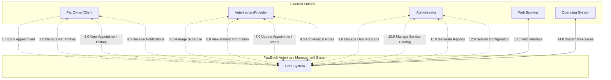
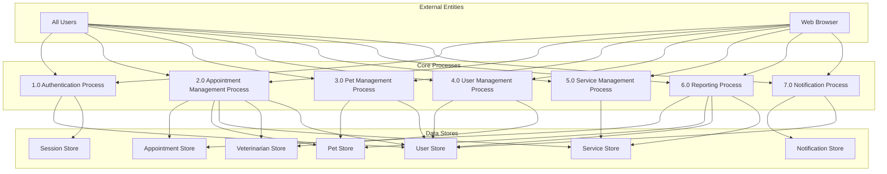
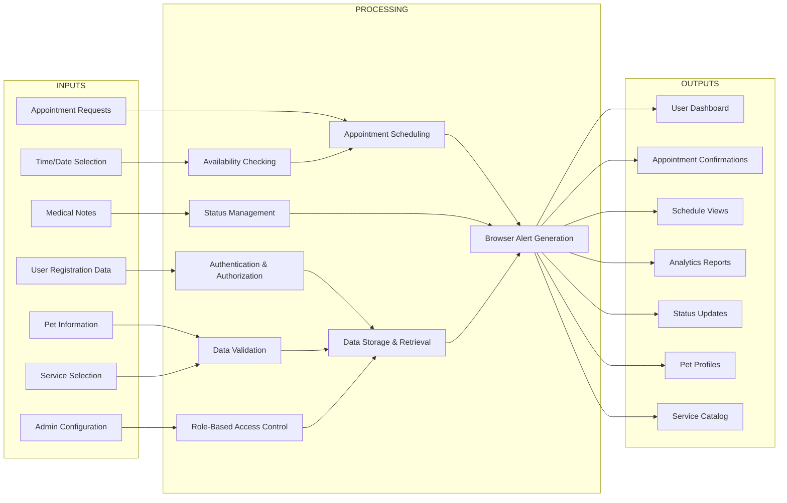

# PawBook Veterinary Management System - Level 0 & Level 1 DFD

## Level 0 DFD - System Context

### Level 0 DFD Description

The Level 0 DFD shows the PawBook Veterinary Management System as a single process interacting with external entities. The system serves three primary user types: Clients (pet owners), Providers (veterinarians), and Administrators. Each user type has specific interactions with the system, numbered 1.0 through 12.0. The web browser (13.0) serves as the interface layer, while the operating system (14.0) provides system resources.

---

## Level 1 DFD - Core System Processes

### Level 1 DFD Process Descriptions

#### **1.0 Authentication Process**
- **Purpose**: Manages user login, logout, and session management
- **Input**: Login credentials, registration data, logout requests
- **Output**: Authentication tokens, user sessions, access permissions
- **Data Stores**: User Store (D1), Session Store (D6)

#### **2.0 Appointment Management Process**
- **Purpose**: Handles all appointment operations including booking, scheduling, status updates, and cancellations
- **Input**: Appointment requests, status updates, cancellation requests
- **Output**: Appointment confirmations, schedule updates, notifications
- **Data Stores**: Appointment Store (D3), Pet Store (D2), Service Store (D4), Veterinarian Store (D5), User Store (D1)

#### **3.0 Pet Management Process**
- **Purpose**: Manages pet profile creation, updates, and maintenance
- **Input**: Pet profiles, updates, deletion requests
- **Output**: Pet records, medical history, appointment links
- **Data Stores**: Pet Store (D2), User Store (D1)

#### **4.0 User Management Process**
- **Purpose**: Handles user account operations including creation, updates, and role management
- **Input**: User data, role assignments, account updates
- **Output**: User accounts, role permissions, access controls
- **Data Stores**: User Store (D1), Veterinarian Store (D5)

#### **5.0 Service Management Process**
- **Purpose**: Manages the service catalog including pricing, duration, and availability
- **Input**: Service definitions, pricing updates, availability changes
- **Output**: Service catalog, pricing information, availability status
- **Data Stores**: Service Store (D4)

#### **6.0 Reporting Process**
- **Purpose**: Generates various reports and analytics for business intelligence
- **Input**: Report requests, date ranges, filter criteria
- **Output**: Reports, analytics, compliance data
- **Data Stores**: Appointment Store (D3), Pet Store (D2), User Store (D1), Service Store (D4)

#### **7.0 Notification Process**
- **Purpose**: Handles all system notifications including reminders and updates
- **Input**: Notification triggers, user preferences, system events
- **Output**: Email notifications, in-app alerts, status updates
- **Data Stores**: Notification Store (D7), User Store (D1)

### Data Stores Description

#### **D1: User Store**
- **Purpose**: Stores all user account information including credentials and roles
- **Data**: User profiles, authentication data, role assignments
- **Access**: Read during authentication, write during registration/updates

#### **D2: Pet Store**
- **Purpose**: Stores pet profiles and medical information
- **Data**: Pet profiles, medical history, owner relationships
- **Access**: Read during appointments, write during profile management

#### **D3: Appointment Store**
- **Purpose**: Stores all appointment records and scheduling data
- **Data**: Appointment details, status, timestamps, notes
- **Access**: High read/write during business operations

#### **D4: Service Store**
- **Purpose**: Stores service catalog and pricing information
- **Data**: Service definitions, pricing, duration, availability
- **Access**: Read-heavy, occasional updates by admin

#### **D5: Veterinarian Store**
- **Purpose**: Stores veterinarian profiles and specialties
- **Data**: Provider information, specialties, schedules
- **Access**: Read for appointment assignment, write for profile updates

#### **D6: Session Store**
- **Purpose**: Stores active user sessions and authentication tokens
- **Data**: Session tokens, user sessions, access permissions
- **Access**: High read/write during login/logout cycles

#### **D7: Notification Store**
- **Purpose**: Stores notification templates and delivery status
- **Data**: Notification logs, delivery status, user preferences
- **Access**: Write for notifications, read for reporting

### Data Flow Summary

#### **User Authentication Flow:**
1. User → Authentication Process (1.0) → User Store (D1) → Session Store (D6)

#### **Appointment Booking Flow:**
2. User → Appointment Process (2.0) → Pet Store (D2) + Service Store (D4) + Veterinarian Store (D5) → Appointment Store (D3) → Notification Process (7.0)

#### **Pet Management Flow:**
3. User → Pet Process (3.0) → Pet Store (D2) → User Store (D1)

#### **Admin Management Flow:**
4. Admin → User Process (4.0) → User Store (D1) + Veterinarian Store (D5)
5. Admin → Service Process (5.0) → Service Store (D4)
6. Admin → Reporting Process (6.0) → All Data Stores

#### **Notification Flow:**
7. All Processes → Notification Process (7.0) → Notification Store (D7) → User Store (D1)

---

## IPO Diagram (Input-Process-Output)

### IPO Diagram Discussion

#### **Input Layer Analysis**

**Primary Input Sources:**
- **User Registration Data (I1)**: New user account information including credentials, contact details, and role assignment. This input forms the foundation of the authentication system and user management.
- **Pet Information (I2)**: Comprehensive pet profiles including species, breed, age, weight, and medical history. This data is critical for appointment booking and patient care.
- **Appointment Requests (I3)**: Core business transaction input containing service preferences, timing requirements, and special considerations. This drives the primary revenue-generating process.
- **Service Selection (I4)**: User choice from predefined service catalog with associated pricing and duration. This input determines appointment scheduling parameters.
- **Time/Date Selection (I5)**: Temporal preferences for appointment scheduling. This input must be validated against provider availability.
- **Medical Notes (I6)**: Clinical observations and treatment notes from veterinarians. This input maintains continuity of care.
- **Admin Configuration (I7)**: System settings, service definitions, and user management parameters. This input controls system behavior and business rules.

#### **Processing Layer Analysis**

**Core Processing Functions:**
- **Authentication & Authorization (P1)**: Validates user credentials and manages role-based access control. This process ensures system security and data privacy by implementing proper authentication mechanisms.
- **Data Validation (P2)**: Ensures data integrity and completeness across all input types. This process prevents invalid data from entering the system and maintains data quality standards.
- **Appointment Scheduling (P3)**: Core business logic that coordinates availability, booking, and confirmation. This process manages the primary workflow of the veterinary clinic.
- **Availability Checking (P4)**: Real-time validation of provider schedules and time slot availability. This process prevents double-booking and optimizes resource utilization.
- **Status Management (P5)**: Tracks and updates appointment lifecycle states. This process provides real-time status information for all stakeholders.
- **Role-Based Access Control (P6)**: Implements permission-based access to system features. This process ensures users only access appropriate functionality.
- **Data Storage & Retrieval (P7)**: Manages persistent data storage and efficient data access patterns. This process ensures data durability and system performance.
- **Browser Alert Generation (P8)**: Creates user notifications using browser alert system. This process provides immediate feedback for user actions.

#### **Output Layer Analysis**

**Primary System Outputs:**
- **User Dashboard (O1)**: Role-specific interface providing access to relevant features and information. This output serves as the primary user interaction point.
- **Appointment Confirmations (O2)**: Immediate feedback confirming successful appointment bookings. This output provides assurance to users and reduces uncertainty.
- **Schedule Views (O3)**: Visual representation of appointments and availability. This output enables efficient time management for both clients and providers.
- **Analytics Reports (O4)**: Business intelligence data for decision-making and compliance. This output supports strategic planning and operational optimization.
- **Status Updates (O5)**: Real-time information about appointment progress and changes. This output keeps all stakeholders informed of current system state.
- **Pet Profiles (O6)**: Comprehensive pet information display for care continuity. This output supports personalized service delivery.
- **Service Catalog (O7)**: Available offerings with pricing and descriptions. This output enables informed service selection by clients.

#### **IPO Integration Analysis**

The IPO diagram demonstrates how PawBook transforms raw inputs into valuable outputs through systematic processing:

1. **Input Validation**: All inputs pass through validation processes to ensure data quality and system integrity.
2. **Business Logic Processing**: Core processes transform validated inputs into business transactions and system state changes.
3. **Output Generation**: Processed data is presented through appropriate output channels for user consumption.
4. **Feedback Loops**: Outputs can generate new inputs, creating continuous system operation cycles.

The IPO model reveals PawBook as a well-structured system that effectively manages the complete veterinary clinic workflow from initial contact through service delivery and follow-up.

---

## Level 0 DFD Discussion

### System Context Analysis

#### **External Entity Interactions**

**Pet Owner/Client (Primary User):**
The client represents the primary revenue source and main system user. Their interactions are comprehensive, spanning the entire appointment lifecycle from booking through completion. The client's four main interactions (1.0-4.0) demonstrate the system's customer-centric design, focusing on convenience and information access.

**Veterinarian/Provider (Service Provider):**
The veterinarian serves as the service delivery mechanism and clinical decision-maker. Their four interactions (5.0-8.0) emphasize clinical workflow management, patient care coordination, and real-time status updates. This reflects the provider's role as both caregiver and system operator.

**Administrator (System Manager):**
The admin represents business operations and system governance. Their four interactions (9.0-12.0) focus on system configuration, user management, and business intelligence. This demonstrates the administrative role in maintaining system integrity and optimizing operations.

**Web Browser (Interface Layer):**
The browser serves as the universal access point, translating system functionality into user interfaces. Its bidirectional communication (13.0) ensures responsive interaction and real-time updates.

**Operating System (Infrastructure):**
The OS provides the foundational platform for system operation. Its resource management role (14.0) ensures system stability and performance.

#### **Data Flow Analysis**

**Client-Facing Flows (1.0-4.0):**
- **Booking Flow (1.0)**: Represents the primary business transaction
- **Pet Management Flow (2.0)**: Supports personalized service delivery
- **History Access Flow (3.0)**: Enables continuity of care
- **Notification Flow (4.0)**: Maintains user engagement

**Provider-Facing Flows (5.0-8.0):**
- **Schedule Management (5.0)**: Optimizes resource utilization
- **Patient Information (6.0)**: Supports clinical decision-making
- **Status Updates (7.0)**: Manages workflow progression
- **Medical Documentation (8.0)**: Maintains care continuity

**Administrative Flows (9.0-12.0):**
- **User Management (9.0)**: Controls system access
- **Service Configuration (10.0)**: Defines business offerings
- **Business Intelligence (11.0)**: Supports strategic decisions
- **System Governance (12.0)**: Maintains operational parameters

The Level 0 DFD effectively captures PawBook's role as an intermediary between stakeholders, translating their needs into coordinated system operations.

---

## Level 1 DFD Discussion

### Process Architecture Analysis

#### **Authentication Process (1.0) - Security Foundation**

**Process Significance:**
The Authentication Process serves as the system's security gatekeeper, establishing user identity and managing access permissions. This process is critical for maintaining data privacy and ensuring appropriate system usage.

**Data Flow Patterns:**
- **Input Processing**: Receives login credentials and registration data from users
- **Validation Operations**: Cross-references User Store (D1) for credential verification
- **Session Management**: Creates and maintains session tokens in Session Store (D6)
- **Access Control**: Provides role-based permissions to other processes

**Business Impact:**
This process enables the multi-role architecture of PawBook, ensuring that clients, providers, and administrators access only appropriate functionality. It establishes the foundation for all subsequent system interactions.

#### **Appointment Management Process (2.0) - Core Business Logic**

**Process Significance:**
This represents the primary business process, managing the complete appointment lifecycle from booking through completion. It coordinates multiple data stores to ensure efficient scheduling and service delivery.

**Data Flow Complexity:**
- **Multi-Store Integration**: Accesses five data stores (D1, D2, D3, D4, D5) for comprehensive appointment management
- **Real-time Processing**: Validates availability, prevents conflicts, and manages status transitions
- **Cross-Entity Coordination**: Links users, pets, services, and providers into coherent appointments

**Business Value:**
This process directly generates revenue through appointment booking and ensures optimal resource utilization through intelligent scheduling. It represents the system's core value proposition.

#### **Pet Management Process (3.0) - Patient Data Foundation**

**Process Significance:**
Manages the comprehensive pet profiles that enable personalized service delivery and continuity of care. This process maintains the clinical foundation for all veterinary services.

**Data Relationships:**
- **Owner Linking**: Connects pets to owners through User Store (D1)
- **Appointment Integration**: Links pet records to appointments through Pet Store (D2)
- **Clinical History**: Maintains medical information for treatment decisions

**Strategic Importance:**
This process enables personalized veterinary care and supports clinical decision-making through comprehensive patient history management.

#### **User Management Process (4.0) - System Administration**

**Process Significance:**
Controls system access and maintains user account integrity. This process is essential for system security and operational management.

**Administrative Functions:**
- **Account Lifecycle**: Manages user creation, updates, and deletion
- **Role Assignment**: Controls access permissions through User Store (D1)
- **Provider Management**: Maintains veterinarian profiles through Veterinarian Store (D5)

**Governance Role:**
This process ensures appropriate system usage and maintains the integrity of the user base that supports all other operations.

#### **Service Management Process (5.0) - Business Configuration**

**Process Significance:**
Defines the service catalog and pricing structure that drives business operations. This process controls the offerings available to clients.

**Business Configuration:**
- **Service Definition**: Maintains service descriptions, durations, and pricing
- **Availability Control**: Manages active/inactive service status
- **Revenue Management**: Controls pricing and service combinations

**Market Adaptability:**
This process enables business agility by allowing rapid service catalog updates and pricing adjustments to respond to market conditions.

#### **Reporting Process (6.0) - Business Intelligence**

**Process Significance:**
Transforms operational data into actionable business intelligence. This process supports strategic decision-making and compliance requirements.

**Data Integration:**
- **Multi-Source Analysis**: Combines data from all operational stores
- **Trend Analysis**: Identifies patterns in usage, revenue, and operational efficiency
- **Performance Metrics**: Tracks key performance indicators for business optimization

**Strategic Value:**
This process enables data-driven decision-making and supports business growth through insights derived from operational data.

### Data Store Architecture Analysis

#### **User Store (D1) - Identity Foundation**
Serves as the master repository for user identity and access control. Its central role in authentication and user management makes it critical for system security.

#### **Pet Store (D2) - Clinical Foundation**
Maintains comprehensive patient profiles that enable personalized care and clinical decision-making. Its integration with appointments ensures care continuity.

#### **Appointment Store (D3) - Transaction Core**
Stores all appointment records and status information. This store represents the system's primary business transaction repository.

#### **Service Store (D4) - Business Catalog**
Contains the service definitions and pricing that drive business operations. This store controls the system's commercial offerings.

#### **Veterinarian Store (D5) - Provider Registry**
Maintains provider profiles and specialties that enable appropriate service assignment. This store supports clinical expertise matching.

#### **Session Store (D6) - Access Management**
Manages active user sessions and authentication tokens. This store enables secure, persistent user access across sessions.

### System Integration Analysis

The Level 1 DFD demonstrates PawBook's sophisticated integration of multiple processes and data stores to deliver comprehensive veterinary management:

1. **Process Interdependence**: Each process relies on multiple data stores, ensuring data consistency and integrity
2. **Data Flow Efficiency**: Direct connections between processes and stores minimize data redundancy
3. **Role-Based Segregation**: Clear separation of concerns based on user roles and responsibilities
4. **Scalable Architecture**: Modular design allows for independent process enhancement and expansion

The Level 1 DFD reveals PawBook as a well-architected system that effectively coordinates complex veterinary clinic operations through intelligent process and data management.

---

**Document Version:** 1.0  
**System:** PawBook Veterinary Management System  
**Document Type:** Level 0 & Level 1 DFD with IPO Analysis  
**Date:** May 8, 2026  
**Scope:** Complete System Context, Core Processes, and IPO Analysis
