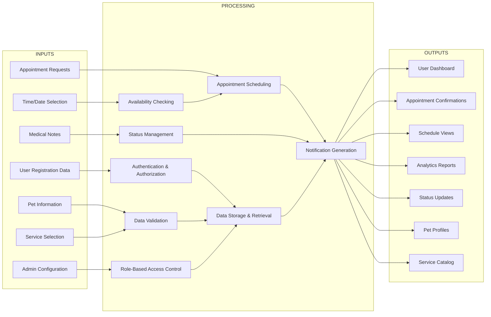
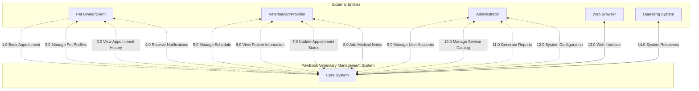
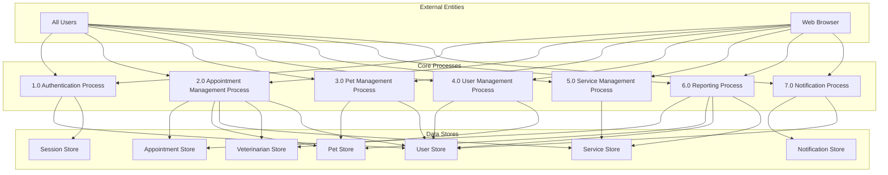
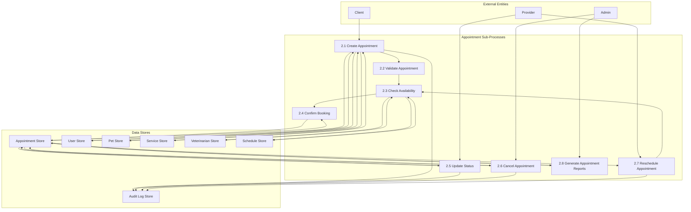
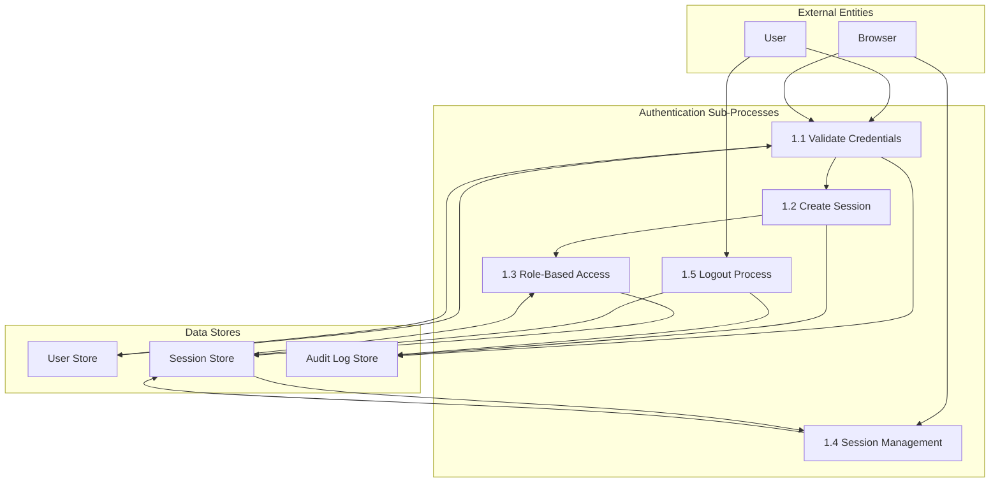
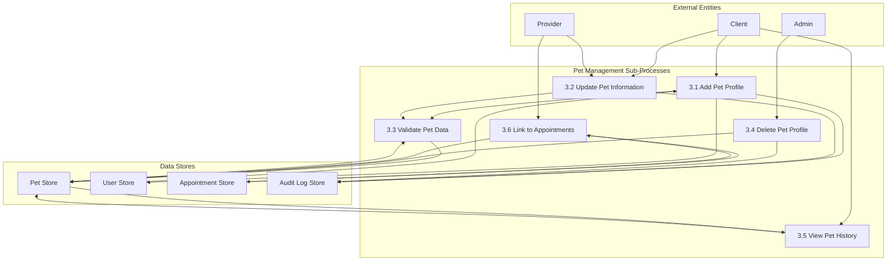
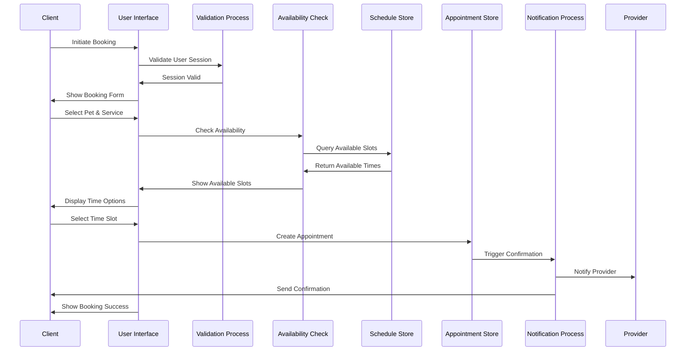
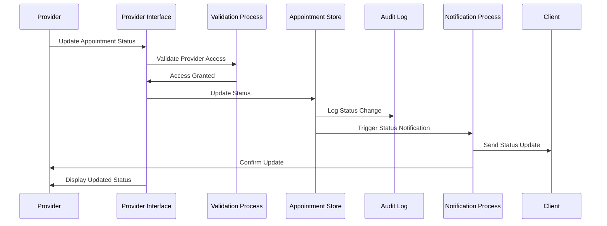
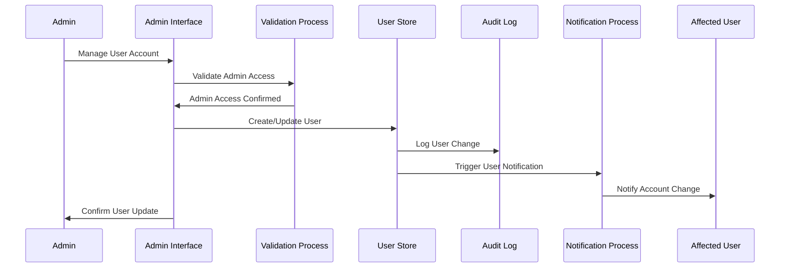

# PawBook Veterinary Management System - Core Foundation Diagrams

## IPO Diagram (Input-Process-Output)

### Core IPO Diagram

### IPO Analysis

#### **Input Layer - Core Foundation**
- **User Registration Data**: Authentication foundation for all system access
- **Pet Information**: Core data entity driving appointment system
- **Appointment Requests**: Primary business transaction input
- **Service Selection**: Service catalog foundation for pricing and scheduling
- **Time/Date Selection**: Temporal foundation for booking system
- **Medical Notes**: Clinical data foundation for patient care
- **Admin Configuration**: System configuration foundation for business rules

#### **Processing Layer - Core Logic**
- **Authentication & Authorization**: Security foundation for role-based access
- **Data Validation**: Data integrity foundation across all operations
- **Appointment Scheduling**: Core business logic foundation
- **Availability Checking**: Resource management foundation
- **Status Management**: Workflow foundation for appointment lifecycle
- **Role-Based Access Control**: Permission foundation for multi-user system
- **Data Storage & Retrieval**: Persistence foundation for all data
- **Notification Generation**: Communication foundation for user engagement

#### **Output Layer - User Interface**
- **User Dashboard**: Primary interface foundation for all user roles
- **Appointment Confirmations**: Transaction confirmation foundation
- **Schedule Views**: Temporal visualization foundation
- **Analytics Reports**: Business intelligence foundation
- **Status Updates**: Real-time information foundation
- **Pet Profiles**: Patient information foundation
- **Service Catalog**: Service offering foundation

---

## System Architecture

### Core System Architecture

```mermaid
graph TB
    subgraph "Context layer (global state)"
        AUTH[AppContext]
        USER[User State]
        APPT[Appointment State]
        PET[Pet State]
        SERVICE[Service State]
    end
    
    subgraph "React Router"
        ROUTER[React Router 6.26.2]
    end
    
    subgraph "User interfaces"
        subgraph "Public"
            LOGIN[Login]
            SIGNUP[Sign Up]
            LANDING[Landing Page]
        end
        
        subgraph "Client"
            CLIENT_DASH[Client Dashboard]
            BOOK_APPT[Book Appointment]
            MY_PETS[My Pets]
            MY_APPTS[My Appointments]
        end
        
        subgraph "Provider"
            PROVIDER_DASH[Provider Dashboard]
            APPT_DETAIL[Appointment Detail]
            MANAGE_SCHED[Manage Schedule]
        end
        
        subgraph "Admin protected only"
            ADMIN_DASH[Admin Dashboard]
            MGMT_USERS[Manage Users]
            MGMT_SERVICES[Manage Services]
            MGMT_APPTS[Manage Appointments]
            REPORTS[Reports]
        end
    end
    
    subgraph "Shared components"
        LAYOUT[Layout]
        NAVBAR[Navbar]
        FOOTER[Footer]
        PROTECTED[ProtectedRoute]
        CARD[Card Component]
        FORM[Form Component]
        CALENDAR[Custom Calendar]
        TIME_PICKER[Time Picker]
        MODAL[Modal Component]
    end
    
    subgraph "Persistence (localStorage)"
        USERS_DB[users]
        PETS_DB[pets]
        APPOINTMENTS_DB[appointments]
        SERVICES_DB[services]
        VETS_DB[veterinarians]
        CURRENT_USER[currentUser]
    end
    
    subgraph "Technologies"
        VITE[Vite 5.2.0]
        REACT[React 18.3.1]
        TYPESCRIPT[TypeScript 5.5.4]
        TAILWIND[TailwindCSS 3.4.17]
        MOTION[Framer Motion 11.5.4]
        ICONS[Lucide React 0.522.0]
        CHARTS[Recharts 2.12.7]
    end
    
    %% Connections
    AUTH --> USER
    AUTH --> APPT
    AUTH --> PET
    AUTH --> SERVICE
    
    USER --> ROUTER
    APPT --> ROUTER
    PET --> ROUTER
    SERVICE --> ROUTER
    
    ROUTER --> LOGIN
    ROUTER --> SIGNUP
    ROUTER --> LANDING
    ROUTER --> CLIENT_DASH
    ROUTER --> PROVIDER_DASH
    ROUTER --> ADMIN_DASH
    
    CLIENT_DASH --> BOOK_APPT
    CLIENT_DASH --> MY_PETS
    CLIENT_DASH --> MY_APPTS
    
    PROVIDER_DASH --> APPT_DETAIL
    PROVIDER_DASH --> MANAGE_SCHED
    
    ADMIN_DASH --> MGMT_USERS
    ADMIN_DASH --> MGMT_SERVICES
    ADMIN_DASH --> MGMT_APPTS
    ADMIN_DASH --> REPORTS
    
    LOGIN --> LAYOUT
    SIGNUP --> LAYOUT
    LANDING --> LAYOUT
    CLIENT_DASH --> LAYOUT
    PROVIDER_DASH --> LAYOUT
    ADMIN_DASH --> LAYOUT
    
    LAYOUT --> NAVBAR
    LAYOUT --> FOOTER
    LAYOUT --> PROTECTED
    
    BOOK_APPT --> CARD
    BOOK_APPT --> FORM
    BOOK_APPT --> CALENDAR
    BOOK_APPT --> TIME_PICKER
    
    APPT_DETAIL --> CARD
    APPT_DETAIL --> MODAL
    
    MANAGE_SCHED --> CALENDAR
    MANAGE_SCHED --> TIME_PICKER
    
    AUTH --> USERS_DB
    AUTH --> CURRENT_USER
    PET --> PETS_DB
    APPT --> APPOINTMENTS_DB
    SERVICE --> SERVICES_DB
    SERVICE --> VETS_DB
    
    VITE --> REACT
    REACT --> TYPESCRIPT
    TYPESCRIPT --> TAILWIND
    TAILWIND --> MOTION
    MOTION --> ICONS
    ICONS --> CHARTS
```

---

## Data Flow Diagram (DFD)

### Level 0 DFD - System Context

### Level 1 DFD - Core System Processes

### Level 2 DFD - Appointment Management Process Detail

### Level 2 DFD - Authentication Process Detail

### Level 2 DFD - Pet Management Process Detail

### Data Flow Sequences

#### **Complete Appointment Booking Flow**

#### **Provider Status Update Flow**

#### **Admin User Management Flow**

### Comprehensive Data Dictionary

#### **Data Elements Definition**

**User-Related Elements:**
- **User_ID**: UUID string (36 chars) - Unique user identifier
- **Email**: String (255 chars) - User email address
- **Password_Hash**: String (255 chars) - Encrypted password
- **Name**: String (100 chars) - Full user name
- **Phone**: String (20 chars) - Contact phone number
- **Role**: Enum ['client', 'provider', 'admin'] - User role
- **Created_At**: DateTime - Account creation timestamp
- **Last_Login**: DateTime - Last login timestamp
- **Status**: Enum ['active', 'inactive', 'suspended'] - Account status

**Pet-Related Elements:**
- **Pet_ID**: UUID string (36 chars) - Unique pet identifier
- **Owner_ID**: UUID string (36 chars) - Reference to owner
- **Name**: String (50 chars) - Pet name
- **Species**: String (50 chars) - Animal species
- **Breed**: String (50 chars) - Animal breed
- **Age**: Integer - Pet age in years
- **Weight**: Decimal (5,2) - Pet weight in kg
- **Medical_Notes**: Text (2000 chars) - Medical history
- **Created_At**: DateTime - Pet profile creation
- **Updated_At**: DateTime - Last profile update

**Appointment-Related Elements:**
- **Appointment_ID**: UUID string (36 chars) - Unique appointment identifier
- **Pet_ID**: UUID string (36 chars) - Reference to pet
- **Owner_ID**: UUID string (36 chars) - Reference to owner
- **Provider_ID**: UUID string (36 chars) - Reference to veterinarian
- **Service_ID**: UUID string (36 chars) - Reference to service
- **Date**: Date - Appointment date (YYYY-MM-DD)
- **Time**: String (8 chars) - Appointment time (HH:MM AM/PM)
- **Status**: Enum ['upcoming', 'completed', 'cancelled', 'checked-in'] - Current status
- **Notes**: Text (1000 chars) - Client notes
- **Visit_Notes**: Text (2000 chars) - Provider visit notes
- **Created_At**: DateTime - Booking timestamp
- **Updated_At**: DateTime - Last status update

**Service-Related Elements:**
- **Service_ID**: UUID string (36 chars) - Unique service identifier
- **Name**: String (100 chars) - Service name
- **Description**: Text (500 chars) - Service description
- **Duration**: Integer - Duration in minutes
- **Price**: Decimal (10,2) - Service price
- **Active**: Boolean - Service availability
- **Category**: String (50 chars) - Service category
- **Created_At**: DateTime - Service creation
- **Updated_At**: DateTime - Last update

#### **Data Flows Definition**

**Authentication Flows:**
- **Login_Request**: {email, password} - User login credentials
- **Login_Response**: {user_data, session_token, role} - Authentication result
- **Logout_Request**: {session_token} - Session termination
- **Session_Validate**: {session_token} - Session validation
- **Role_Check**: {user_id, resource} - Permission verification

**Appointment Flows:**
- **Appointment_Create**: {pet_id, service_id, date, time, notes} - New appointment
- **Appointment_Update**: {appointment_id, status, notes} - Status update
- **Appointment_Query**: {date, provider_id, status} - Appointment search
- **Availability_Check**: {date, service_id} - Time slot availability
- **Appointment_Cancel**: {appointment_id, reason} - Cancellation request

**Pet Management Flows:**
- **Pet_Create**: {owner_id, name, species, breed, age, weight} - New pet
- **Pet_Update**: {pet_id, fields_to_update} - Pet information update
- **Pet_Query**: {owner_id, pet_id} - Pet information request
- **Pet_History**: {pet_id} - Medical history request

**Notification Flows:**
- **Notification_Create**: {recipient_id, type, message, data} - New notification
- **Notification_Send**: {notification_id, channel} - Send notification
- **Notification_Read**: {notification_id, user_id} - Mark as read
- **Notification_Delete**: {notification_id} - Remove notification

#### **Data Stores Definition**

**User Store:**
- **Purpose**: Store all user account information
- **Primary Key**: User_ID
- **Indexes**: Email, Role, Status
- **Data Volume**: Estimated 1000-10000 records
- **Access Patterns**: Read-heavy during login, write during registration

**Pet Store:**
- **Purpose**: Store pet profiles and medical information
- **Primary Key**: Pet_ID
- **Foreign Keys**: Owner_ID
- **Indexes**: Owner_ID, Species, Name
- **Data Volume**: Estimated 2000-20000 records
- **Access Patterns**: Read-heavy for appointments, moderate writes for updates

**Appointment Store:**
- **Purpose**: Store all appointment records
- **Primary Key**: Appointment_ID
- **Foreign Keys**: Pet_ID, Owner_ID, Provider_ID, Service_ID
- **Indexes**: Date, Provider_ID, Status, Owner_ID
- **Data Volume**: Estimated 5000-50000 records annually
- **Access Patterns**: High read/write during business hours

**Service Store:**
- **Purpose**: Store service catalog and pricing
- **Primary Key**: Service_ID
- **Indexes**: Category, Active, Name
- **Data Volume**: Estimated 50-200 records
- **Access Patterns**: Read-heavy, occasional updates

**Session Store:**
- **Purpose**: Store active user sessions
- **Primary Key**: Session_Token
- **Indexes**: User_ID, Expiry_Time
- **Data Volume**: Estimated 100-500 concurrent sessions
- **Access Patterns**: High read/write during login/logout

**Audit Log Store:**
- **Purpose**: Store system audit trail
- **Primary Key**: Log_ID
- **Indexes**: User_ID, Timestamp, Action_Type
- **Data Volume**: Estimated 10000-100000 records annually
- **Access Patterns**: Write-heavy, occasional reads for compliance

#### **Data Quality Rules**

**Validation Rules:**
- **Email**: Must be valid email format
- **Phone**: Must match phone number pattern
- **Date**: Must be future date for appointments
- **Time**: Must be within business hours
- **Age**: Must be reasonable for species
- **Weight**: Must be positive number

**Integrity Rules:**
- **Foreign Keys**: Must reference existing records
- **Uniqueness**: Email addresses must be unique
- **Business Rules**: Cannot double-book same time slot
- **Status Flow**: Must follow valid status transitions

**Security Rules:**
- **Password**: Must meet complexity requirements
- **PII**: Sensitive data must be encrypted
- **Access**: Role-based data access restrictions
- **Audit**: All data changes must be logged

---

## Core Foundation Summary

### **System Pillars**

1. **Authentication Foundation**: Role-based access control securing all system operations
2. **Data Foundation**: Structured data models ensuring consistency and integrity
3. **Process Foundation**: Business logic driving all veterinary clinic operations
4. **Interface Foundation**: User-centric design for all three user roles
5. **Technology Foundation**: Modern web stack ensuring performance and scalability

### **Key Architectural Decisions**

1. **Component-Based Architecture**: Modular design for maintainability
2. **React Context for State**: Centralized state management
3. **Role-Based Access**: Three-tier user permission system
4. **Progressive Enhancement**: Ready for backend integration
5. **Responsive Design**: Mobile-first approach for accessibility

### **Scalability Considerations**

1. **Modular Components**: Easy to extend and modify
2. **Service-Oriented Design**: Clear separation of concerns
3. **State Management**: Efficient data flow patterns
4. **Technology Stack**: Modern and well-supported technologies
5. **Data Architecture**: Structured for future enhancements

---

**Document Version:** 1.0  
**System:** PawBook Veterinary Management System  
**Focus:** Core Foundation Architecture  
**Date:** May 8, 2026
