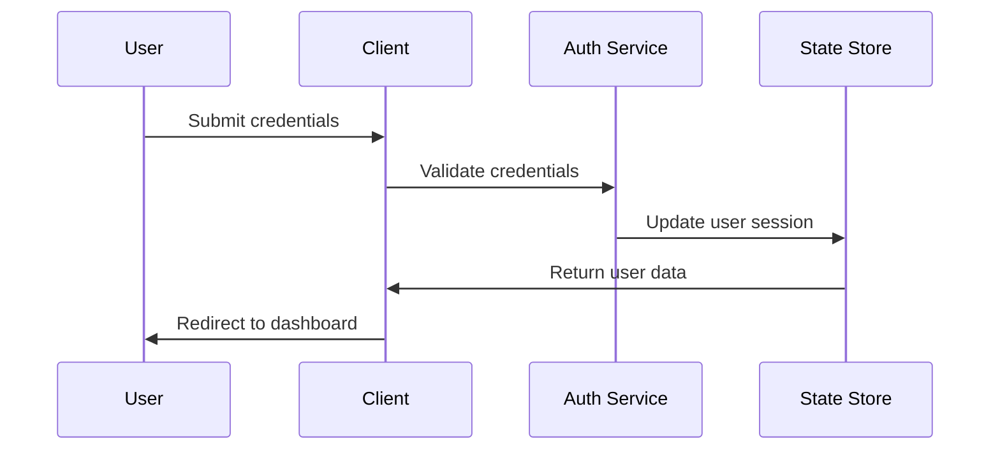
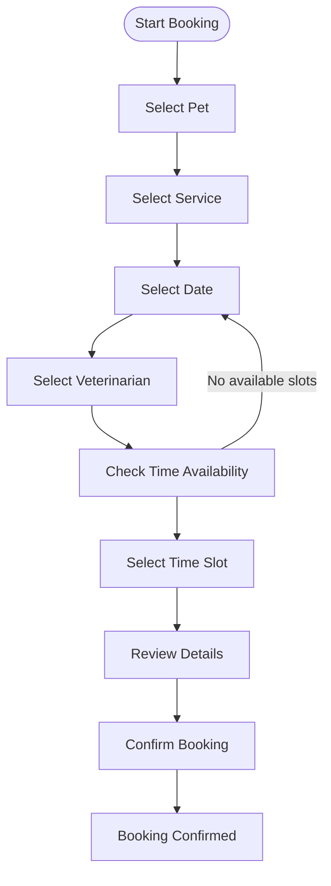
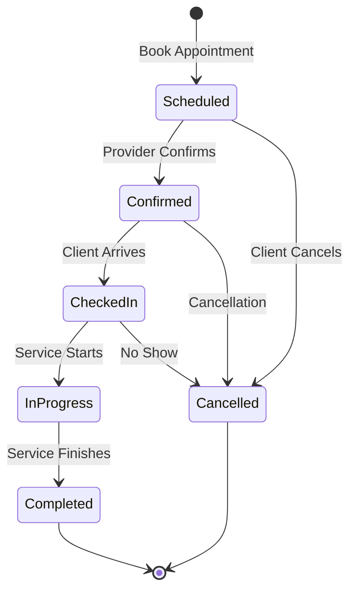
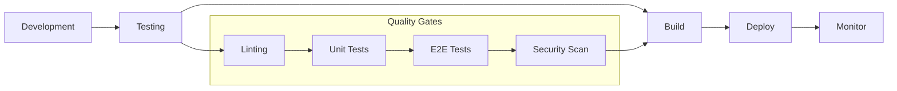

# PawBook Veterinary Management System - Technical Specification

## 📋 Executive Summary

PawBook is a modern, web-based veterinary clinic management system designed to streamline appointment scheduling, pet management, and clinic operations. The system serves three distinct user roles: Clients, Providers (Veterinarians), and Administrators, each with tailored interfaces and permissions.

## 🎯 System Requirements

### Functional Requirements

#### Client Requirements
- **CR-001**: Clients must be able to register and authenticate
- **CR-002**: Clients must manage pet profiles (add, edit, delete)
- **CR-003**: Clients must book appointments for their pets
- **CR-004**: Clients must view upcoming and past appointments
- **CR-005**: Clients must receive appointment confirmations

#### Provider Requirements
- **PR-001**: Providers must view daily appointment schedules
- **PR-002**: Providers must update appointment statuses
- **PR-003**: Providers must manage availability and time slots
- **PR-004**: Providers must access patient information
- **PR-005**: Providers must add visit notes and medical records

#### Administrator Requirements
- **AR-001**: Administrators must manage all system users
- **AR-002**: Administrators must manage service catalog
- **AR-003**: Administrators must oversee all appointments
- **AR-004**: Administrators must generate reports and analytics
- **AR-005**: Administrators must manage clinic settings

### Non-Functional Requirements

#### Performance Requirements
- **NFR-001**: Page load time must be under 3 seconds
- **NFR-002**: Application must support 100+ concurrent users
- **NFR-003**: Real-time updates for appointment status changes

#### Security Requirements
- **NFR-004**: Role-based access control implementation
- **NFR-005**: Secure authentication and session management
- **NFR-006**: Data encryption for sensitive information

#### Usability Requirements
- **NFR-007**: Responsive design for mobile and desktop
- **NFR-008**: Intuitive navigation and user interface
- **NFR-009**: Accessibility compliance (WCAG 2.1 AA)

## 🏗️ System Architecture

### Architecture Pattern
- **Pattern**: Component-based architecture with React
- **State Management**: React Context API with custom hooks
- **Routing**: Client-side routing with React Router
- **Styling**: Utility-first CSS with TailwindCSS

### Technology Stack
```typescript
interface TechStack {
  frontend: {
    framework: 'React 18.3.1';
    language: 'TypeScript 5.5.4';
    bundler: 'Vite 5.2.0';
    styling: 'TailwindCSS 3.4.17';
    animations: 'Framer Motion 11.5.4';
    icons: 'Lucide React 0.522.0';
  };
  routing: 'React Router DOM 6.26.2';
  stateManagement: 'React Context API';
  dataVisualization: 'Recharts 2.12.7';
  backend: 'Supabase 2.103.3 (configured)';
}
```

## 📊 Data Models

### Core Entities

#### User Model
```typescript
interface User {
  id: string;                    // Unique identifier
  email: string;                 // Login email
  password: string;              // Hashed password
  name: string;                  // Full name
  phone: string;                 // Contact number
  role: UserRole;                // User role
}

type UserRole = 'client' | 'provider' | 'admin';
```

#### Pet Model
```typescript
interface Pet {
  id: string;                    // Unique identifier
  ownerId: string;               // Owner reference
  name: string;                  // Pet name
  species: string;               // Species (dog, cat, etc.)
  breed: string;                 // Breed
  age: number;                   // Age in years
  weight: number;                // Weight in kg
  medicalNotes: string;          // Medical history
}
```

#### Service Model
```typescript
interface Service {
  id: string;                    // Unique identifier
  name: string;                  // Service name
  duration: number;              // Duration in minutes
  price: number;                 // Price in local currency
  active: boolean;               // Service availability
}
```

#### Appointment Model
```typescript
interface Appointment {
  id: string;                    // Unique identifier
  petId: string;                 // Pet reference
  ownerId: string;               // Owner reference
  serviceId: string;             // Service reference
  veterinarianId: string;        // Provider reference
  date: string;                  // Appointment date (YYYY-MM-DD)
  time: string;                  // Appointment time (HH:MM AM/PM)
  status: AppointmentStatus;     // Current status
  notes?: string;                // Client notes
  visitNotes?: string;           // Provider visit notes
}

type AppointmentStatus = 'upcoming' | 'completed' | 'cancelled' | 'checked-in';
```

#### Veterinarian Model
```typescript
interface Veterinarian {
  id: string;                    // Unique identifier
  name: string;                  // Full name
  specialty: string;             // Medical specialty
}
```

### State Management Structure
```typescript
interface AppState {
  currentUser: User | null;
  users: User[];
  pets: Pet[];
  services: Service[];
  veterinarians: Veterinarian[];
  appointments: Appointment[];
  
  // Authentication actions
  signIn: (email: string, password: string) => User | null;
  signUp: (user: Omit<User, 'id'>) => User;
  signOut: () => void;
  
  // Pet management actions
  addPet: (pet: Omit<Pet, 'id'>) => Pet;
  updatePet: (id: string, pet: Partial<Pet>) => void;
  deletePet: (id: string) => void;
  
  // Appointment management actions
  addAppointment: (appointment: Omit<Appointment, 'id'>) => Appointment;
  updateAppointment: (id: string, appointment: Partial<Appointment>) => void;
  cancelAppointment: (id: string) => void;
  
  // User management actions
  addUser: (user: Omit<User, 'id'>) => User;
  updateUser: (id: string, user: Partial<User>) => void;
  deleteUser: (id: string) => void;
  
  // Service management actions
  updateService: (id: string, service: Partial<Service>) => void;
  addService: (service: Omit<Service, 'id'>) => Service;
  deleteService: (id: string) => void;
  
  // Veterinarian management actions
  addVeterinarian: (vet: Omit<Veterinarian, 'id'>) => Veterinarian;
  deleteVeterinarian: (id: string) => void;
}
```

## 🛡️ Security Specification

### Authentication Flow


### Authorization Matrix
| Resource | Client | Provider | Admin |
|----------|---------|----------|-------|
| Own Profile | ✅ | ✅ | ✅ |
| Own Pets | ✅ | ❌ | ✅ |
| Own Appointments | ✅ | ❌ | ✅ |
| All Appointments | ❌ | ✅ (assigned) | ✅ |
| Service Management | ❌ | ❌ | ✅ |
| User Management | ❌ | ❌ | ✅ |
| System Reports | ❌ | ❌ | ✅ |

### Security Measures
1. **Input Validation**: All form inputs validated before processing
2. **Role-Based Access**: Protected routes with role checking
3. **Data Sanitization**: XSS prevention in user inputs
4. **Secure Storage**: Sensitive data handled appropriately
5. **Session Management**: Proper session cleanup on logout

## 🎨 UI/UX Specification

### Design System
```typescript
interface DesignSystem {
  colors: {
    primary: '#f59e0b';      // Amber-500
    secondary: '#6b7280';    // Gray-500
    success: '#10b981';      // Green-500
    warning: '#f59e0b';      // Amber-500
    error: '#ef4444';        // Red-500
    neutral: '#f3f4f6';      // Gray-100
  };
  
  typography: {
    fontFamily: 'system-ui, -apple-system, sans-serif';
    scale: [12, 14, 16, 18, 20, 24, 30, 36, 48];
  };
  
  spacing: {
    scale: [4, 8, 12, 16, 20, 24, 32, 40, 48, 64];
  };
  
  breakpoints: {
    mobile: '640px';
    tablet: '768px';
    desktop: '1024px';
    wide: '1280px';
  };
}
```

### Component Library
```typescript
interface ComponentLibrary {
  layout: {
    Container: 'Responsive container component';
    Card: 'Content card with shadow and border';
    Grid: 'CSS Grid layout helper';
  };
  
  forms: {
    Input: 'Text input with validation';
    Select: 'Dropdown selection';
    Button: 'Action button with variants';
    Form: 'Form wrapper with validation';
  };
  
  feedback: {
    Alert: 'Status message component';
    Modal: 'Overlay dialog component';
    Toast: 'Notification component';
  };
  
  navigation: {
    Navbar: 'Main navigation bar';
    Sidebar: 'Side navigation panel';
    Breadcrumb: 'Navigation breadcrumb';
  };
}
```

## 🔄 Business Logic Specification

### Appointment Booking Workflow


### Appointment State Machine


## 📊 Performance Specification

### Performance Metrics
```typescript
interface PerformanceMetrics {
  loadTime: {
    target: '< 3 seconds';
    measurement: 'Page load complete';
  };
  
  responseTime: {
    target: '< 500ms';
    measurement: 'User interaction response';
  };
  
  bundleSize: {
    target: '< 2MB';
    measurement: 'Total JavaScript bundle';
  };
  
  lighthouse: {
    target: '> 90';
    measurement: 'Lighthouse performance score';
  };
}
```

### Optimization Strategies
1. **Code Splitting**: Route-based lazy loading
2. **Bundle Optimization**: Tree shaking and minification
3. **Image Optimization**: WebP format and lazy loading
4. **Caching**: Service worker implementation
5. **CDN**: Static asset distribution

## 🧪 Testing Specification

### Testing Strategy
```typescript
interface TestingStrategy {
  unit: {
    framework: 'Jest';
    coverage: '> 80%';
    focus: 'Component logic and utilities';
  };
  
  integration: {
    framework: 'React Testing Library';
    coverage: '> 70%';
    focus: 'Component interactions';
  };
  
  e2e: {
    framework: 'Playwright/Cypress';
    coverage: 'Critical user flows';
    focus: 'End-to-end workflows';
  };
  
  performance: {
    tools: 'Lighthouse CI';
    metrics: 'Core Web Vitals';
    focus: 'Performance regression';
  };
}
```

### Test Cases
#### Authentication Tests
- Valid login credentials
- Invalid login credentials
- Session persistence
- Logout functionality

#### Appointment Booking Tests
- Complete booking flow
- Time slot validation
- Double booking prevention
- Booking cancellation

#### Role Access Tests
- Client access restrictions
- Provider access permissions
- Admin access control
- Unauthorized access handling

## 🚀 Deployment Specification

### Build Process
```bash
# Development
npm run dev          # Start development server
npm run lint         # Run code quality checks

# Production
npm run build        # Build for production
npm run preview      # Preview production build
```

### Environment Configuration
```typescript
interface EnvironmentConfig {
  development: {
    apiUrl: 'http://localhost:5173';
    logLevel: 'debug';
    mockData: true;
  };
  
  production: {
    apiUrl: 'https://api.pawbook.com';
    logLevel: 'error';
    mockData: false;
  };
  
  staging: {
    apiUrl: 'https://staging-api.pawbook.com';
    logLevel: 'warn';
    mockData: false;
  };
}
```

### Deployment Pipeline


## 🔮 Future Enhancements

### Phase 2 Features
1. **Real-time Notifications**: WebSocket integration
2. **Mobile Application**: React Native development
3. **Payment Processing**: Stripe integration
4. **Advanced Reporting**: Custom analytics dashboard
5. **Multi-clinic Support**: Tenant architecture

### Technical Improvements
1. **Backend Integration**: Full API implementation
2. **Database Migration**: PostgreSQL with Supabase
3. **State Management**: Migration to Redux Toolkit
4. **Testing**: Comprehensive test suite
5. **CI/CD**: Automated deployment pipeline

### Scalability Considerations
1. **Microservices Architecture**: Service decomposition
2. **Load Balancing**: Horizontal scaling
3. **Caching Strategy**: Redis implementation
4. **Monitoring**: Application performance monitoring
5. **Security**: Advanced security measures

## 📝 Documentation Standards

### Code Documentation
- JSDoc comments for all functions
- TypeScript interfaces for all data structures
- Component prop documentation
- README files for major components

### API Documentation
- OpenAPI/Swagger specification
- Endpoint documentation
- Request/response examples
- Error handling documentation

### User Documentation
- User manual for each role
- Video tutorials
- FAQ section
- Support contact information

## 🎯 Success Metrics

### Business Metrics
- User adoption rate
- Appointment booking efficiency
- Customer satisfaction score
- Revenue impact

### Technical Metrics
- System uptime (> 99.9%)
- Page load performance
- Bug resolution time
- Code quality score

### User Experience Metrics
- User satisfaction rating
- Task completion rate
- Error rate reduction
- Support ticket reduction

---

*This technical specification serves as the foundation for the PawBook Veterinary Management System development and future enhancements.*
